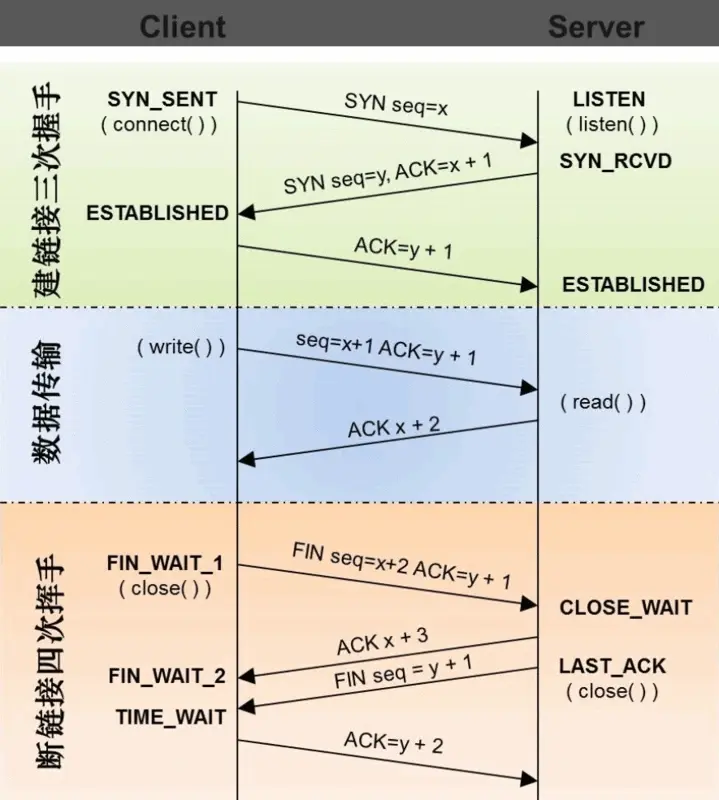

## http

### 请求方式
1. GET： 获取服务器的资源
2. POST： 发送数据给服务器
3. DELETE：删除服务器上的指定资源
4. PUT：　给服务器添加资源
5. PATCH：修改服务器中的资源
6. HEAD： 获取头部信息与GET方式的头部信息一致
7. TRACE： 回显服务器收到的请求，主要用于测试或诊断
8. CONNECT： HTTP/1.1协议中预留给能够将连接改为管道方式的代理服务器
9. OPTION: 用于获取目的资源所支持的通信选项

### WEB分层
1. 应用层
2. 传输层
3. 网络层
4. 链路层
请求端每通过一层都会增加头部信息
接收端每通过一层都会删除头部信息

### 请求报文：
1. 请求行（请求方法，url,协议版本）
2. 请求头（关键字：值）
3. 空行
4. 请求体（post put请求携带的数据）

### 响应报文：
1. 响应行（协议版本，状态码，状态码原因短语）
2. 响应头（关键字：值）
3. 空行
4. 响应体（响应数据）

### cookie http无状态
cookie 会通过响应报文中的Set-Cookie 字段来通知客户端自动保存cookie,下次请求时客户端会自动发送cookie,服务器比对数据得到状态结果

### GET POST的区别
副作用： 对服务器资源做改变
幂等： 指发送 M 和 N 次请求（两者不相同且都大于1），服务器上资源的状态一致
Get 多用于无副作用，幂等的场景
Post 多用于副作用，不幂等的场景

Get 请求能缓存，Post 不能
Post 相对 Get 安全一点点，因为Get 请求都包含在 URL 里，且会被浏览器保存历史纪录，Post 不会，但是在抓包的情况下都是一样的。
Post 可以通过 request body来传输比 Get 更多的数据，Get 没有这个技术
URL有长度限制，会影响 Get 请求，但是这个长度限制是浏览器规定的，不是 RFC 规定的
Post 支持更多的编码类型且不对数据类型限制

### POST PUT区别
POST:　是非幂等的，可以指向资源集
PUT: 是幂等的，指向某一具体资源

### PUT PATCH区别
PUT: 整体替换
PATCH： 局部修改

### 常见状态码
- 2XX 成功
- 200 OK，表示从客户端发来的请求在服务器端被正确处理
- 204 No content，表示请求成功，但响应报文不含实体的主体部分
- 206 Partial Content，进行范围请求
- 3XX 重定向
- 301 moved permanently，永久性重定向，表示资源已被分配了新的 URL
- 302 found，临时性重定向，表示资源临时被分配了新的 URL
- 303 see other，表示资源存在着另一个 URL，应使用 GET 方法定向获取资源
- 304 not modified，表示服务器允许访问资源，但因发生请求未满足条件的情况
- 307 temporary redirect，临时重定向，和302含义相同
- 4XX 客户端错误
- 400 bad request，请求报文存在语法错误
- 401 unauthorized，表示发送的请求需要有通过 HTTP 认证的认证信息
- 403 forbidden，表示对请求资源的访问被服务器拒绝
- 404 not found，表示在服务器上没有找到请求的资源
- 5XX 服务器错误
- 500 internal sever error，表示服务器端在执行请求时发生了错误
- 503 service unavailable，表明服务器暂时处于超负载或正在停机维护，无法处理请求

### 302 303 307区别
303 307是302状态码的细分
303 会将post 请求变成get 请求进行重定向
307 会遵守浏览器标准，不会将post 讲求转成 get 请求

### keep-alive作用
keep-alive: 重用连接，创建连接需要资源与时间
Connection： keep-alive

### http https
https 是安全版的http，http 数据是明文进行传输的
1. 二进制分帧的方式进行通信
2. 多路复用（对于同一个域名可以共用一个tcp 连接）
3. 头部压缩（只会发送差异的数据）

### https 如何保证安全
1. 对称加密与非对称加密加上第三方证书保证接收的公钥是来自客户端和服务器
对称加密： 双方使用同一个密钥进行加密解密（无法保证密钥传输过程的安全性）
2. 非对称加密： 双方通信前先将各自的公钥传输给对方，使用对方的公钥加密，使用自己的私钥解密（性能不好，速度慢）
3. 对称加密与非对称加密结合： 通过非对称加密的方式传递公钥，之后进行对称加密（中间人问题）
4. 引入双方信任的第三方，生成数字签名确保公钥来自正确的地方

### http缓存
1. 客户端向服务器请求资源
2. 服务器通过响应头向客户端设置缓存策略
3. 客户端向服务器请求资源，会查看缓存策略，命中并且没有过期，使用客户端自身的缓存，否则请求服务器

强缓存：离不开两个响应头`expires` `cache-control`,前者描述的是一个绝对时间，改变本地时间会影响缓存失效，后者描述的是一个相对时间
Cache-Control: 
	- private: 只能在终端进行缓存，不允许中继服务器缓存
	- public： 可以被所有用户缓存
	- no-cache：先缓存在本地，但是命中之后要与服务器验证缓存新鲜度再决定是否使用缓存
	- no-store：不会产生任何缓存

协商缓存：`last-modified` `if-modified-since` 使用时间验证资源的新鲜度 `etag` `if-none-match` 使用hash 验证资源的新鲜度

### 三次握手与四次挥手
摘自文章:[浏览器输入URL到请求全过程以及相应的性能优化](https://juejin.im/post/5c2591e351882569b02456e3)

1. 第一次握手：建立连接
客户端发送连接请求报文段，将SYN值设为1，Sequence Number为x。客户端进入SYN_SEND状态，等待服务器的确认。
2. 第二次握手：服务器收到SYN报文段
服务器收到客户端SYN报文段，需要对这个SYN报文段进行确认，设置Acknowledgment Number为x+1(Sequence Number+1)。同时，自己自己还要发送SYN请求信息，将SYN值设为1，Sequence Number设为y。服务器端将上述所有信息放到一个报文段（即SYN+ACK报文段）中，一并发送给客户端，服务器进入SYN_RECV状态。
3. 第三次握手：客户端收到SYN+ACK报文段
客户端收到服务器的SYN+ACK报文段后将Acknowledgment Number设置为y+1，向服务器发送ACK报文段，这个报文段发送完毕以后，客户端和服务器端都进入ESTABLISHED状态，完成TCP三次握手。

#### 为什么要有三次握手
为了防止已失效的连接请求报文段实然又传输到了服务器，因而产生错误

“已失效的连接请求报文段”的产生在这样一种情况下：client发出的第一个连接请求报文段并没有丢失，而是在某个网络结点长时间的滞留了，以致延误到连接释放以后的某个时间才到达server。本来这是一个早已失效的报文段。但server收到此失效的连接请求报文段后，就误认为是client再次发出的一个新的连接请求。于是就向client发出确认报文段，同意建立连接。假设不采用“三次握手”，那么只要server发出确认，新的连接就建立了。由于现在client并没有发出建立连接的请求，因此不会理睬server的确认，也不会向server发送数据。但server却以为新的运输连接已经建立，并一直等待client发来数据。这样，server的很多资源就白白浪费掉了。采用“三次握手”的办法可以防止上述现象发生。例如刚才那种情况，client不会向server的确认发出确认。server由于收不到确认，就知道client并没有要求建立连接。”

#### 为什么要有四次挥手
TCP协议是一种面向连接的、可靠的、基于字节流的运输层通信协议。TCP是全双工模式，这就意味着，当主机1发出FIN报文段时，只是表示主机1已经没有数据要发送了，主机1告诉主机2，它的数据已经全部发送完毕了；但是，这个时候主机1还是可以接受来自主机2的数据；当主机2返回ACK报文段时，表示它已经知道主机1没有数据发送了，但是主机2还是可以发送数据到主机1的；当主机2也发送了FIN报文段时，这个时候就表示主机2也没有数据要发送了，就会告诉主机1，我也没有数据要发送了，之后彼此就会愉快的中断这次TCP连接。

