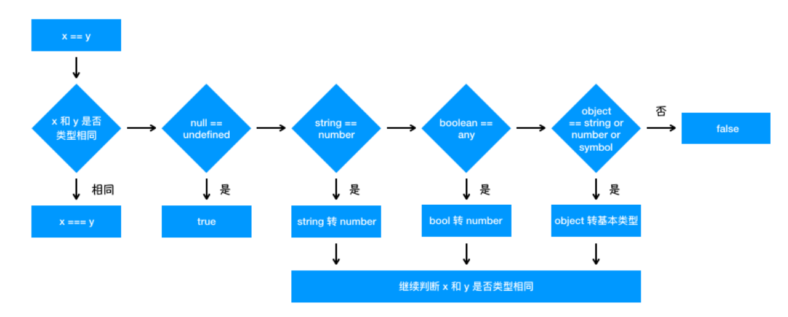

## 基本数据类型 复杂数据类型存储方式
基本数据类型： 存储在栈中，闭包存储在堆内存中
复杂数据类型： 存储在堆内存中

## typeof
1. 使用`typeof aaa` `aaa` 是一个未定义的变量依旧会返回`undefined`
2. `typeof` 对于对象，除了函数都会返回`object`
3. `typeof null` 返回`object` ps: 32位操作系统中使用低位存储变量的类型信息，000 代表对象，而`null` 全为0
4. `void` 后面跟个表达式，问题返回`undefined`
<<<<<<< acd44f89644ebca8121c0b26bfadc7ba48f392a4
=======
5. 低版本浏览器（IE9以下，不包括IE9）`undefined`会被赋值，它不是保留字
>>>>>>> update:第一次提交笔记内容

## 转Boolean
- 在条件判断时，除了 undefined， null， false， NaN， ''， 0， -0，其他所有值都转为 true，包括所有对象
- [] == false 为true

## 对象转基本类型
<<<<<<< acd44f89644ebca8121c0b26bfadc7ba48f392a4
1. 对象转基本类型首先会调用`valueof`方法，然后调用`toString`方法

## 四则运算符
1. 加法运算时，一方是字符串，会将另一方也转换成字符串，否则只要一方是数字，另一方会转化成数字
=======
- 如果已经是原始类型了，那就不需要转换了
- 如果需要转字符串类型就调用 x.toString()，转换为基础类型的话就返回转换的值。不是字符串类型的话就先调用 valueOf，结果不是基础类型的话再调用 toString
- 调用 x.valueOf()，如果转换为基础类型，就返回转换的值
- 如果都没有返回原始类型，就会报错
- 当然你也可以重写 Symbol.toPrimitive ，该方法在转原始类型时调用优先级最高

```js
let a = {
  valueOf() {
    return 0
  },
  toString() {
    return '1'
  },
  [Symbol.toPrimitive]() {
    return 2
  }
}
1 + a // => 3
```

注意图中有一个错误，Boolean 转字符串这行结果我指的是 true 转字符串的例子，不是说 Boolean、函数、Symblo 转字符串都是 `true`


## 四则运算符
- 运算中其中一方为字符串，那么就会把另一方也转换为字符串
- 如果一方不是字符串或者数字，那么会将它转换为数字或者字符串
- 除了加法的运算符来说，只要其中一方是数字，那么另一方就会被转为数字

## `==`操作符


>>>>>>> update:第一次提交笔记内容

## 原型
1. 每个函数都有`prototype`属性，除了`Function.prototype.bind()`，每个对象都有`__proto__`属性

## 提升
1. 函数声明提升高于变量声明提升
2. 非匿名自调用函数中打印这个自调用函数结果会是函数本身，会创建一个自执行函数名相同的只读属性
```js
var foo = 1
(function foo() {
    foo = 10
    console.log(foo)
}()) // -> ƒ foo() { foo = 10 ; console.log(foo) }
```

## setTimeout setInterval
1. setTimeout setInterval 共用一个编码池，技术上，可以使用clearInterval 清除setTimeout,反之也可
2. setTimeout setInterval 第三个参数及其后的参数作为第一个参数的实参

<<<<<<< acd44f89644ebca8121c0b26bfadc7ba48f392a4
## CommonJS 与 ES6 模块化的区别 
CommonJS 是同步加载的 ES6模块化是异步加载的
CommonJS 是执行时加载 ES6模块化是编译时加载
CommonJS 导出的是值的拷贝 ES6 导出的是值的引用

## DOMContentLoaded
1. 如果页面中同时存在css和js，并且存在js在css后面，则DOMContentLoaded事件会在css加载完后才执行。
2. 其他情况下，DOMContentLoaded都不会等待css加载，并且DOMContentLoaded事件也不会等待图片、视频等其他资源加载。
=======
## 模块化
1. 解决命名冲突
2. 提供复用性
3. 提高代码可维护性
### CommonJS 与 ES6 模块化的区别 
CommonJS 是同步加载的 ES6模块化是异步加载的
CommonJS 是执行时加载 ES6模块化是编译时加载
CommonJS 导出的是值的拷贝 ES6 导出的是值的引用
ES模块化会编译是require,exports 来执行
CommonJS支持动态导入

## this

```js
let a = {}
let fn = function () { console.log(this) }
fn.bind().bind(a)() // => ?
// 不管我们给函数 bind 几次，fn 中的 this 永远由第一次 bind 决定，所以结果永远是 window。
```

### this绑定的优先级
- new > bind/apply/call > obj.property > func()
- 首先，new 的方式优先级最高，接下来是 bind 这些函数，然后是 obj.foo() 这种调用方式，最后是 foo 这种调用方式，同时，箭头函数的 this 一旦被绑定，就不会再被任何方式所改变。


## 深浅拷贝
1. JSON.parse(JSON.stringify(obj))
- 不足：
1.1 忽略symbol,undefined
1.2 不能序列化函数
1.3 不能解决循环引用对象

## var let const 
1. 函数提升优先于变量提升，函数提升会把整个函数挪到作用域顶部，变量提升只会把声明挪到作用域顶部
2. var 存在提升，我们能在声明之前使用。let、const 因为暂时性死区的原因，不能在声明前使用
3. var 在全局作用域下声明变量会导致变量挂载在 window 上，其他两者不会
4. let 和 const 作用基本一致，但是后者声明的变量不能再次赋值
>>>>>>> update:第一次提交笔记内容
