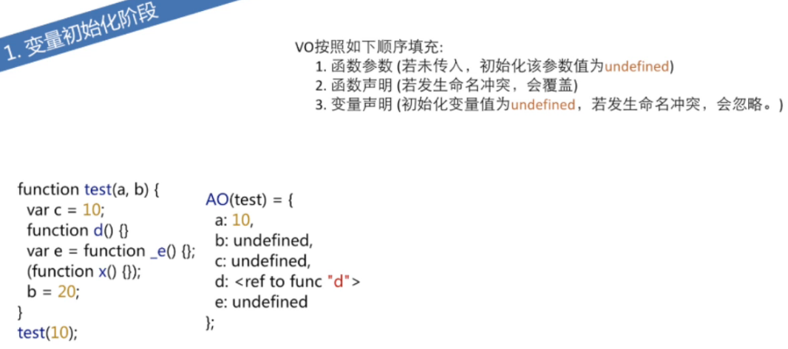

### 数组

- 数组长度范围  [0,2^23-1]

- new Array()

  - 一个number参数就会定义长度为 n的空数组，而不是每个元素都是undefined
  - 两个及以上个参数，分别为数组的元素

> var arr = [1,2,3]   delete arr[0] 不会删除第一个元素，而是将第一个元素的值变成 undefined
> 为数组添加一个“看起来”像一个数字的属性时，它会变成一个数值下标，length会增加，否则是增加一个属性并不是向数组中增加一个元素

​	数组方法总结

<<<<<<< acd44f89644ebca8121c0b26bfadc7ba48f392a4
- 修改原数组的有：(pop,push,unshift,shift[返回新数组的长度]),splice(返回改变部分)，sort(根据ASCLL表排序，返回排序之后的结果)
=======
- 修改原数组的有：(pop,push,unshift,shift[返回新数组的长度]),splice(返回改变部分)，sort(根据ASCLL表排序，返回排序之后的结果), reverse
>>>>>>> update:第一次提交笔记内容
- 不修改原数组的有： slice(返回切取的部分),concat,join,map,reduce,filter

### Array

tips: forEach和map 方法都会跳过empty的元素，不会跳过 undefined的元素

1. Array.from() 将一个类数组，可迭代对象转化成一个浅拷贝的数组实例


#### Array.prototype

1. Array.prototype.pop() 删除数组最后一个元素
2. Array.prototype.push() 向数组最后添加一个元素
3. Array.prototype.shift() 删除数组第一个元素
4. Array.prototype.unshift() 向数组第一个位置添加一个元素
5. Array.prototype.concat() 数组拼接，拼接时会拉平一层数组
6. Array.prototype.join()  返回一个字符串，中间为join的参数
7. Array.prototype.map() 数组的每一项执行回调函数
8. Array.prototype.reduce(func, value)  数组中的前后两项参与运算/逻辑返回结果当作func的第一个参数
9. Array.prototype.reduceRight(func, value) 与reduce()相同，只不过运算/逻辑是从右开始的
10. Array.prototype.filter() 从数组中筛选符合条件的元素
11. Array.prototype.every() return Boolean 判断数组中每一项是满足回调函数中的条件
12. Array.prototype.forEach(value, index, arr)
13. Array.prototype.some()  return Boolean 判断数组中是否有一项满足条件
14. Array.prototype.indexOf(查找的元素， 从第一个元素开始查找) 返回查找到的第一个元素
15. Array.prototype.lastIndexOf(查找的元素， 从第最后一个元素开始查找) 返回查找到的第一个元素
16. Array.isArray(需要判断的)  return Boolean 判断参数是否是数组


```javascript
console.log('-------slice------')
const arr = [1, 2, 3, 4, 5]
const slice = arr.slice(1, 3)
console.log(slice) // [2,3]
console.log(arr) // [1, 2, 3, 4, 5]

console.log('-------pop-------')
const pop = arr.pop() //
console.log(pop) // 5
console.log(arr) // [1,2,3,4]

console.log('--------push------')
const push = arr.push(5)
console.log(push) // 5
console.log(arr) // [1, 2, 3, 4, 5]

console.log('--------unshift------')
const unshift = arr.unshift(0)
console.log(unshift) // 6
console.log(arr) // [0, 1, 2, 3, 4, 5]

console.log('--------shift------')
const shift = arr.shift()
console.log(shift) // 0
console.log(arr) // [1, 2, 3, 4, 5]

console.log('--------splice------')
const splice = arr.splice(1,2,'a','b')
console.log(splice) // [2,3]
console.log(arr) // [1, 'a', 'b', 4, 5]
```


### 字符串


模版解析（ES6）：

```javascript
var name='jack', gender='male'
console.log(`naem is ${name}, gender is ${gender}`)
```


### 函数

- Function 构造器可以访问全局的变量，但不可以访问上层函数的变量

```javascript
var global = 'string'
;(function() {
    var local = 'javascript'
    Function('console.log(typeof global), console.log(typeof local)')() // 'string' undefined
})()
```

#### Function.prototype

1. Function.prototype.bind()


### 闭包


```
当一个内部函数被其外部函数之外的变量引用时，就形成了一个闭包。
内部函数引用了外部函数的变量（方法），当外部函数被调用，内部函数被定义产生闭包
闭包产生个数为外部函数被调用几次
1. 闭包是嵌套的内部函数
2. 包含被引用变量（函数）的对象
缺点：使用闭包性能会比不使用闭包的性能更差
作用：使用函数内部的变量在函数执行完后，仍然在内存中（延长了局部变量的生命周期
      让函数外部可以操作（读写）到函数内部的数据（）变量和函数）
```


### new运算符

- new运算符做了什么
  1. 生成一个空对象
  2. 将新建对象作用this 的上下文
  3. 执行函数中的代码（添加属性和方法）
  4. 如果返回的不是对象则返回新创建的对象

```javascript
function Person(age){
    this.age= age;
    console.log(this);
    return {age:age};//返回对象
}

new Person(20) = { // new 实际执行情况

    var obj = {}; // 1

    obj.__proto__ = Person.prototype; // 3

    var result = Person.call(obj,20); // 2

    return typeof result === 'object'? result : obj; // 4
}  // Person{age: 20}
```


### delete操作符


 **delete 操作符**用于 ***删除对象的某个属性*** ；如果没有指向这个属性的引用，那它最终会被释放。

语法：

```
delete object.property 
delete object['property']
```

- 如果你试图删除的属性不存在，那么delete将不会起任何作用，但仍会返回true

- 如果对象的原型链上有一个与待删除属性同名的属性，那么删除属性之后，对象会使用原型链上的那个属性（也就是说，***delete操作只会在自身的属性上起作用***）

- 任何使用 `var`***声明的属性不能从全局作用域或函数的作用域中删除。***

  - 这样的话，delete操作不能删除任何在全局作用域中的函数（无论这个函数是来自于函数声明或函数表达式）
  - 除了在全局作用域中的函数不能被删除，在对象(object)中的函数是能够用delete操作删除的。

- ***任何用[`let`](https://developer.mozilla.org/zh-CN/docs/Web/JavaScript/Reference/Statements/let)或[`const`](https://developer.mozilla.org/zh-CN/docs/Web/JavaScript/Reference/Statements/const)声明的属性不能够从它被声明的作用域中删除。***

- ***不可设置的(Non-configurable)属性不能被移除***。这意味着像[`Math`](https://developer.mozilla.org/zh-CN/docs/Web/JavaScript/Reference/Global_Objects/Math), [`Array`](https://developer.mozilla.org/zh-CN/docs/Web/JavaScript/Reference/Array), [`Object`](https://developer.mozilla.org/zh-CN/docs/Web/JavaScript/Reference/Global_Objects/Object)内置对象的属性以及使用[`Object.defineProperty()`](https://developer.mozilla.org/zh-CN/docs/Web/JavaScript/Reference/Global_Objects/Object/defineProperty)方法设置为不可设置的属性不能被删除。

- a = 1 delete window.a // true  隐式的全局变量可以删除


### 无分号编码风格

- 当你的采用了无分号代码风格时，只需要注意以下三种情况就不 会产生语法解析错误。
  - 以 ***(  [  `*** 开头的时候，在前面补上一个分号


### 类型检测

- instanceof  对象

- typeof  函数、基本数据类型 `typeof null` => 'object'

- Object.prototype.toString  全能  `Object.prototype.toString.apply([])`

  会将判断的内容转化成对象再进行判断

  > Object.prototype.toString.call(1) // [Object Number]
  >
  > Object.prototype.toString.call(new Number(1)) // [Object Number]

- constructor

- duck type


### 序列化

- JSON.stringify(obj)

  - value 为undefined 的属性不会转变成字符串
  - value 为 NaN,Infinity 的属性值会变成 null
  - value 为 Date 类型的属性会变成 UTC格式

  ```javascript
  obj = {val : undefined, a : NaN, b : Infinity, c : new Date()};
  JSON.stringify(obj); // "{"a":null,"b":null,"c":"2015-01-20T14:15:43.910Z"}"
  
  ```

  

- JSON.parse('{"a": "123"}')

- 自定义序列化

```javascript
var obj = {
    x : 1,
    y : 2,
    o : {
        o1 : 1,
        o2 : 2,
        toJSON : function () {
            return this.o1 + this.o2;
        }
    }
};
JSON.stringify(obj); // "{"x":1,"y":2,"o":3}"

```


### Object.prototype

tips: for in 和 Object.keys(), Object.values(), Object.entries() 都不会遍历 symbol的属性


1. Object.create(obj)

   > var obj = Object.create({a:1})

   给obj 对象上的隐匿原型增加了一个对象 {a: 1}

2. Object.getOwnPropertyDescriptor(obj, obj上的属性)

   - obj存在该属性，返回该属性的描述符对象 {writable： false, configurable: false, enumerable: false,value: 100}
   - obj不存在该属性，返回undefined

3. Object.defineProperty(obj,'添加的属性名'，{属性描述符})

   - 为obj 添加一个属性
   - **注意** configurable: false, writable: true 时，可以将writable修改为 false

4. Object.defineProperties(obj,{属性名: {属性描述符}……}) 

   - 配置多个属性

5. Object.prototyoe.hasOwnProperty('属性名')

   - return Boolean

6. Object.prototype.propertyIsEnumerable('属性名')

   - return Boolean  判断属性是否可以枚举

7. Object.keys(obj) 返回一个数组，自身可枚举的属性组成

8. Object.isExtensible(obj) 判断对象是否可以扩展

9. Object.preventExtensions(obj) 阻止对象扩展

10. Object.seal(obj) 将对象中的属性的 configurable 变成false

11. Object.freeze(obj) 将对象中的属性的 configurable，writable 变成false
12. Object.prototype.isPorpertyOf(obj) 检测实例对象的原型链上是否有obj


### 执行上下文

- VO 变量对象
- AO 激活对象
- EC 执行上下文




+ 执行顺序
  1. 函数参数（未传入，初始值为undefined）
  2. 函数声明（若发生命名冲突后者覆盖前者）
  3. 变量声明（初始值为undefined,若发生命名冲突，会忽略）


### 继承

```javascript
function Person(name, gender) {
  this.name = name
  this.gender = gender
}

Person.prototype.say = function() {
  console.log(`my name is ${this.name}, I'm a ${this.gender}`)
}
Person.prototype.LEGS_NUM = 2
Person.prototype.ARMS_NUM = 2

function Student(name, gender, className) {
  Person.call(this, name, gender)
  this.className = className
}

// Object.create() 的作用是创建一个空对象，并将参数作为空对象的原型
Student.prototype = Object.create(Person.prototype)
Student.prototype.constructor = Student

Student.prototype.learn = function() {
  console.log(`I'm study in ${this.className}`)
}

const s = new Student('cj', '男', 'grades 6')

console.log(s.LEGS_NUM, s.ARMS_NUM) // 2 2
s.say()
s.learn()
```


- 不是所有对象的原型链上都有Object.prototype
- 不是所有对象都有 prototype

```javascript
var obj1 = Object.create(null)
obj1.__proto__ === Object.prototype 

var obj2 = Object.bind(null)
obj2.prototype
```


### prototype

- 动态的修改 prototype的属性时，已经创建的实例对象也会被影响
- 修改整个 ptototype时，已经创建的实例对象不受影响,但会影响后续创建的实例

```javascript
Student.prototype.x = 101
s.x // 101

Student.prototype = {y: 2}
s.y // undefined
s.x // 101

var s1 = new Student('rose', 27, 'grades 8')
s1.x // undefined
s1.y // 2
```


### 正则表达式

. | 任意字符(除换行符以外：\n,\r,\u2028,\u2029)
- | - 
+ | 一次或多次
* | 0，1，多次
？ | 0，1次
\d | 数字0-9
\D | 非\d，即非0-9
\w | 数字0-9，a-z,A-Z,下划线
\W | 非\w
\s | 空格符，tab,换页符，换行符
\S | 非\s |
\t \r \n \v \f | tab 回车 换行 垂直制表符 换页符 
[] | 字符范围
[^...] | 字符范围以外
^ | 行首，以...开头
$ | 行尾
\b | 零宽单词边界
\B | 非\b
(x) | 分组，并记录匹配到的字符串
\n | 表示使用分组符（x）匹配到的字符串
(?:x) | 公分组
x* x+ | 重复次数>=0 重复次数>0 贪婪算法
x*? x+? | 同上，非贪婪算法
x? | 出现0或1次
xly | x或者y
x{n} x{n,} x{n,m} | 重复n次，重复>=n次，重复次数x 满足：[n,m]
g(global) | 全文匹配
m(multline) | 换行匹配
i(ignoreCase) | 忽略大小写


### setTimeout

1.第二个参数之后的是第一个参数函数的参数
```js
setTimeout(function(a, b) {
	console.log(a + b)
}, 2000, 10, 20)

// 二秒后打印出30
```

1. 渲染进程，消息队列，延迟队列（定时器...）