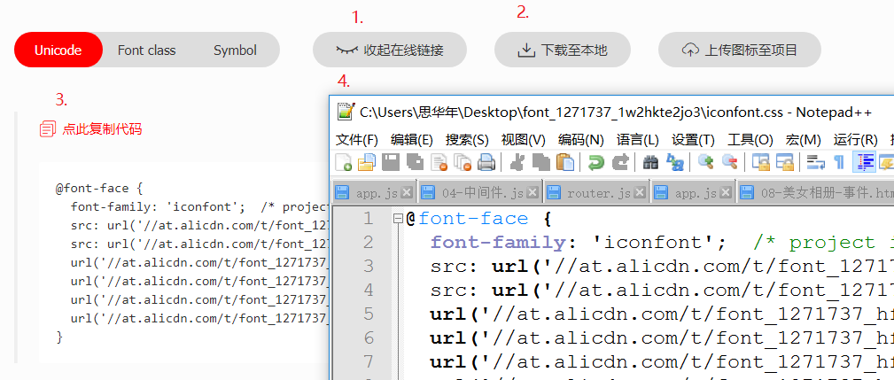

# 微信小程序


## API文档

https://developers.weixin.qq.com/miniprogram/dev/framework/


## app.json

### 1. pages

- 哪个文件写在上面，就先显示哪个文件


> 花括号与·“·之间如果有空格会被当做字符串来解析


## 组件

1. <text> => <span>

2. <view> => <div>

3. <swiper><swiper-item></swiper></swiper>
	- swiper默认宽高为100%，150px
	- swiper-item默认宽高为100%，100%
	
4. <image>

5. <navigator>

   **open-type 的合法值**

   | 值           | 说明                                                         | 最低版本                                                     |
   | :----------- | :----------------------------------------------------------- | :----------------------------------------------------------- |
   | navigate     | 对应 [wx.navigateTo](https://developers.weixin.qq.com/miniprogram/dev/api/route/wx.navigateTo.html) 或 [wx.navigateToMiniProgram](https://developers.weixin.qq.com/miniprogram/dev/api/open-api/miniprogram-navigate/wx.navigateToMiniProgram.html) 的功能 |                                                              |
   | redirect     | 对应 [wx.redirectTo](https://developers.weixin.qq.com/miniprogram/dev/api/route/wx.redirectTo.html) 的功能 |                                                              |
   | switchTab    | 对应 [wx.switchTab](https://developers.weixin.qq.com/miniprogram/dev/api/route/wx.switchTab.html) 的功能 |                                                              |
   | reLaunch     | 对应 [wx.reLaunch](https://developers.weixin.qq.com/miniprogram/dev/api/route/wx.reLaunch.html) 的功能 | [1.1.0](https://developers.weixin.qq.com/miniprogram/dev/framework/compatibility.html) |
   | navigateBack | 对应 [wx.navigateBack](https://developers.weixin.qq.com/miniprogram/dev/api/route/wx.navigateBack.html) 的功能 | [1.1.0](https://developers.weixin.qq.com/miniprogram/dev/framework/compatibility.html) |
   | exit         | 退出小程序，`target="miniProgram"`时生效                     | [2.1.0](https://developers.weixin.qq.com/miniprogram/dev/framework/compatibility.html) |
   
6. <template>

   - name=“模版名称”
   - is="模版名称"
   - data="{{...item}}"
   - 引入wxml: <import src='路径'/>
   - 引入js require('路径') ，要使用相对路径
   - 引入wxss: @import '路径';


## 选择器

目前支持的选择器有：

| 选择器           | 样例             | 样例描述                                       |
| :--------------- | :--------------- | :--------------------------------------------- |
| .class           | `.intro`         | 选择所有拥有 class="intro" 的组件              |
| #id              | `#firstname`     | 选择拥有 id="firstname" 的组件                 |
| element          | `view`           | 选择所有 view 组件                             |
| element, element | `view, checkbox` | 选择所有文档的 view 组件和所有的 checkbox 组件 |
| ::after          | `view::after`    | 在 view 组件后边插入内容                       |
| ::before         | `view::before`   | 在 view 组件前边插入内容                       |


## 引入字体图标



1. 生成代码
2. 下载字体
3. 复制代码
4. 替换下载解压后的iconfont.css文件中的@font-face部分
5. 复制iconfont.css文件内容，粘贴到需要引用字体的.wxss文件中
6. 向需要使用字体图标的组件中加入两个类名**iconfont**,和**字体图标本身的类名**


## 事件

捕获 处理 冒泡

事件委托


bind+事件名,不会阻止事件的冒泡行为

catch+事件名，会阻止事件的冒泡行为


## 生命周期

### 进程


### 线程


### wx.getUserInfo 获取用户信息

### wx.getSetting 获取用户当前设置


 ```javascript 
isGetUserInfo() {

​    wx.getSetting({

​      success: (data) => {

​        if (data.authSetting['scope.userInfo']) {

​          this.setData({

​            isShow: false

​          })

​        } else {

​          this.setData({

​            isShow: true

​          })

​        }


​        wx.getUserInfo({

​          success: (res) => {

​            this.setData({

​              userInfo: res.userInfo

​            })

​          },

​          fail: () => {

​            console.log('获取用户数据失败！')

​          }

​        })

​      }

​    })

  }
 ```


### 存储缓存数据

1. 第一次onLoad渲染页面
    1.1 查看是否存在指定键名的缓存数据
  1.2 初始化指定缓存数据为空对象
2. 之后进入页面onLoad读取和存储缓存数据
    2.1 当进入页面时判断是否存在指定的数据
  2.2 获取当前页面的缓存数据，并初始化页面
3. 当缓存数据改变时，调用函数保存新的缓存数据


```javascript
1

const detailStorage = wx.getStorageSync('isShow')
    console.log(detailStorage)
    // 第一次加载将存储收藏状态的缓存初始化为空对象
    if(!detailStorage) {
      wx.setStorageSync('isShow', {})
    }
2
    // 如果缓存对象中当前详情页已经收藏，将isShow设置为true
    if(detailStorage[index]) {
      this.setData({
        isShow: true
      })
    }

    // 获取对象中键名为index的值并存储
    wx.getStorage({
      key: index,
      success: function(res) {
        console.log(res)
        wx.setStorage({
          key: index,
          data: isShow,
        })
      },
    })
  }
  
  
3 
  wx.getStorage({
      key: 'isShow',
      success: (datas) => {
        let obj = datas.data
        let index = this.data.index
        //缓存到本地
        obj[index] = isShow
        wx.setStorage({
          key: 'isShow',
          data: obj,
          success: (data) => {
            console.log("缓存成功")
          }
        })
      }
    })
  
  
```


wx:setStorageSync()

wx:setStroage()

wx:getStorageSync()

wx:getStorage()


